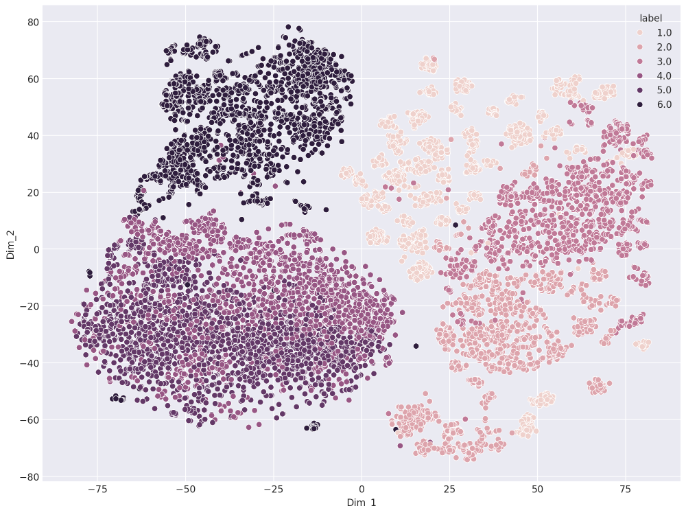
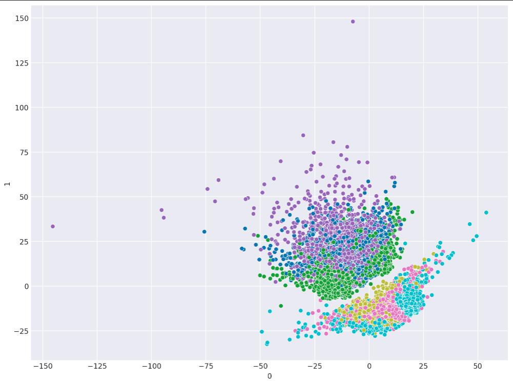
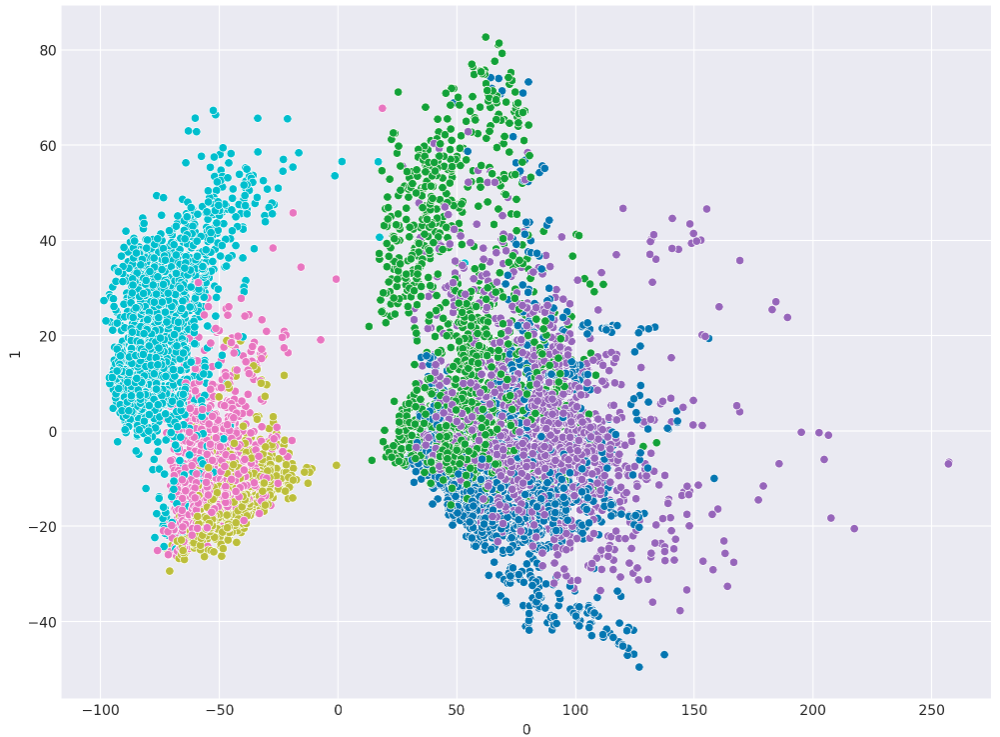

# 📱 Activity Clustering Project: Unsupervised Analysis of Sensor Data

Проект представляет собой кластеризацию для идентификации видов физической активности на основе данных сенсоров мобильного телефона. 

## 🎯 Постановка задачи
Цель: Автоматическое выявление паттернов активности человека (6 классов) на основе:

Условия:
- Высокая размерность данных (561 признак)
- Требование масштабирования и оптимизации вычислительных ресурсов

## ✨ Особенности решения
- Интеллектуальное масштабирование: StandardScaler для сохранения относительных расстояний
- Оптимальное снижение размерности: PCA с порогом 90% объясненной дисперсии
- Сравнение алгоритмов:
  - K-Means с оптимизацией числа кластеров
  - Иерархическая агломеративная кластеризация
- Мультиметрическая оценка:
  - Davies-Bouldin Score (минимизация)
  - Silhouette Score (максимизация)
- Продвинутая визуализация:
  - 2D проекции (PCA, t-SNE, MDS, Isomap)

## 🛠 Установка
1. Клонировать репозиторий:
git clone https://github.com/yourusername/activity-clustering.git
cd activity-clustering

## 🔬 Этапы анализа

### 1. Предобработка данных
- Нормализация сигналов (StandardScaler)

### 2. Снижение размерности
- Применение PCA для 90% дисперсии
- Оптимальное число компонент: 65 (сокращение размерности в ~8.6 раз)
- Анализ вклада компонент:

### 3. Кластеризация
| Метод               | Число кластеров | Davies-Bouldin | Silhouette |
|---------------------|-----------------|----------------|------------|
| K-Means             | 6               | 2.05           | 0.14       |
| Agglomerative       | 6               | 2.12           | 0.15       |

## 📊 Результаты
- Лучший алгоритм: K-Means с Davies-Bouldin 2.05
- Кластеры успешно разделяют:
  высокую активность(ходить, бегать итд) от низкой (лежать, сидеть итд)
- Выявленные аномалии: смешение подъем/спуск по лестнице

## 🎨 Визуализации

| t-SNE                         | MDS                          | Isomap                       |
|-------------------------------|------------------------------|------------------------------|
|     |       | |

t-sne оказалась лучше в данном случае
